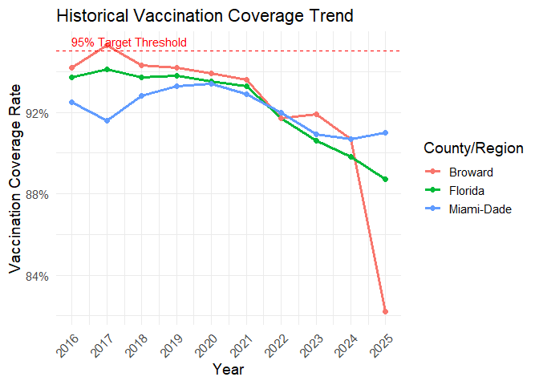
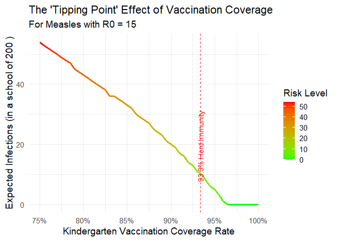
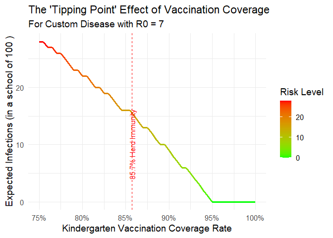

<!-- README.md is generated from README.Rmd. Please edit that file -->

# vaxineR 

<!-- badges: start -->

[](https://lifecycle.r-lib.org/articles/stages.html#experimental)
[](https://www.gnu.org/licenses/gpl-3.0)
<!-- badges: end -->

`vaxineR` is an R package for analyzing kindergarten vaccine coverage
data and modeling potential infectious disease outbreak risks. It
provides functions to calculate key epidemiological metrics, generate
summary tables, and create insightful visualizations based on historical
Florida county data.

## Key Features

- Calculate Effective Reproduction Number (Re), outbreak probabilities,
  and expected infections.
- Model risk for different diseases (Measles, Pertussis, Chickenpox) and
  scenarios.
- Includes cleaned, tidy historical vaccination data for Florida
  counties (2016-2024).
- Generate publication-ready plots for risk curves, outbreak
  probabilities, and historical trends.
- Export the data underlying any plot to CSV or Excel for further
  analysis.

## Installation

You can install the development version of vaxineR from GitHub with:

``` r
# install.packages("devtools")
devtools::install_github("YOUR-GITHUB-USERNAME/vaxineR")
```

## Example Usage

``` r
library(vaxineR)
library(dplyr)
#> 
#> Attaching package: 'dplyr'
#> The following objects are masked from 'package:stats':
#> 
#>     filter, lag
#> The following objects are masked from 'package:base':
#> 
#>     intersect, setdiff, setequal, union
```

### 1. Basic Calculations

Calculate the expected number of measles infections in a school of 100
students where vaccination coverage is 88%.

``` r
calc_expected_infections(
  vc = 0.88,
  VE = 0.97,
  disease = "Measles",
  kindergarten_size = 100
)
#> [1] 13
```

### 2. Generate a Risk Summary Table

Quickly assess the situation for a given year. The table shows risk
scenarios for the statewide average and counties at different coverage
quantiles.

``` r
summary_infection_risk(yr = 2024, disease = "Measles", VE = 0.97)
#> # A tibble: 6 × 7
#>   Scenario      `Vaccination Coverage` `Effective R (Re)` Susceptible (N = 200…¹
#>   <chr>         <chr>                               <dbl>                  <dbl>
#> 1 Statewide Av… 89.8%                                1.93                     26
#> 2 Minimum       83.4%                                2.87                     39
#> 3 25th Percent… 88.9%                                2.06                     28
#> 4 Median        91.4%                                1.7                      23
#> 5 75th Percent… 93.0%                                1.48                     20
#> 6 Maximum       96.6%                                0.94                     13
#> # ℹ abbreviated name: ¹​`Susceptible (N = 200)`
#> # ℹ 3 more variables: `Expected Infections` <dbl>,
#> #   `Prob >=1 Secondary Case` <chr>, `Prob Major Outbreak` <chr>
```

### 3. Visualize Historical Trends

Plot the vaccination coverage history for a few key counties.

``` r
plot_coverage_history(county_name = c("Florida", "Miami-Dade", "Broward"))
```



### 4. Plot a Risk Curve and Save the Data

Visualize the non-linear “tipping point” of outbreak risk. We will also
save the underlying data to an Excel file, which will contain both the
data and a metadata sheet describing it.

``` r
plot_risk_curve(
  disease = "Measles",
  VE = 0.97,
  kindergarten_size = 200,
  save_data_to = "measles_risk_curve_data.xlsx"
)
#> Plot data and metadata saved to 'measles_risk_curve_data.xlsx'
```



The generated file `measles_risk_curve_data.xlsx` will now be in your
working directory.

### 5. Modeling a Custom Disease

You can model any hypothetical disease by setting disease = “Custom” and
providing a value for r0_custom.

``` r
plot_risk_curve(
  disease = "Custom",
  VE = 0.90,
  r0_custom = 7,
  kindergarten_size = 100
)
```


